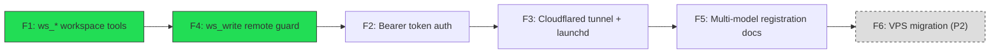

# Multi-Model Feature Backlog

Backlog for opening MemoryBridge up to non-Claude-Code clients (ChatGPT, Gemini,
Perplexity, Claude Desktop) over the existing HTTP bridge (`_run_http()` in
`server.py`), plus the workspace-file access those clients need once they're
no longer running inside a repo checkout.

Conventions used below match the existing codebase: `config.py`'s
`data_dir()`-style env-var-first config, `server.py`'s `@mcp.tool()` /
`_REMOTE_MODE` pattern, and the `tests/unit/` layout.

## Implementation order

F1 and F4 ship together (a write tool with no remote guard is a standing
vulnerability the moment F2/F3 expose it to the internet). F2 needs F1+F4 to
have something worth authenticating. F3 needs F2 — no tunnel in front of an
unauthenticated bridge. F5 documents the stack once it's real. F6 is a P2
port of the whole thing to a VPS, deferred until the Mac setup is validated.



---

## F1 — `ws_*` workspace tools

**Problem statement**

Non-Claude-Code clients (ChatGPT, Gemini, Perplexity) have no filesystem — they
only see what an MCP tool hands them. MemoryBridge's memory store is not a
substitute for letting a model read/write scratch notes, drafts, or reference
files. There's currently no tool surface for that at all, and no notion of a
sandboxed root a remote client is allowed to touch.

**Solution / pseudocode**

New `workspace.py` module (sibling to `config.py`, `exports.py`), plus five
`@mcp.tool()` wrappers registered in `server.py`.

Config (extends `config.py`'s existing `data_dir()`-style pattern):

```python
# config.py additions
def workspace_root() -> Path:
    """Sandboxed root for ws_* tools. Never the code dir."""
    return Path(os.environ.get(
        "MEMORYBRIDGE_WORKSPACE_ROOT",
        Path.home() / "memorybridge" / "workspace"
    )).expanduser()

# DEFAULT_CONFIG addition — empty allowlist = no writes permitted (deny by
# default; F1 ships read tools live, writes stay locked until configured).
DEFAULT_CONFIG["workspace_write_allowed"] = []   # e.g. ["notes/", "scratch/"]
```

Path traversal guard (shared by all five tools):

```python
# workspace.py
class WorkspaceError(Exception):
    pass

def _resolve(rel_path: str) -> Path:
    root = config.workspace_root().resolve()
    candidate = (root / rel_path).resolve()
    if not candidate.is_relative_to(root):
        raise WorkspaceError(f"path escapes workspace root: {rel_path!r}")
    return candidate

def _is_write_allowed(rel_path: str) -> bool:
    allowed = config.load_config().get("workspace_write_allowed", [])
    return any(rel_path.startswith(prefix) for prefix in allowed)
```

Tools:

```python
def ws_status() -> dict:
    root = config.workspace_root()
    if not root.is_dir():
        return {"error": f"WORKSPACE_ROOT not found: {root}"}
    files = [p for p in root.rglob("*") if p.is_file()]
    return {"root": str(root), "file_count": len(files),
            "write_allowed": config.load_config().get("workspace_write_allowed", [])}

def ws_list(path: str = "", recursive: bool = False) -> dict:
    target = _resolve(path)
    if not target.is_dir():
        return {"error": f"not a directory: {path}"}
    pattern = "**/*" if recursive else "*"
    entries = sorted(str(p.relative_to(config.workspace_root())) for p in target.glob(pattern))
    return {"path": path, "entries": entries}

def ws_read(path: str) -> dict:
    target = _resolve(path)
    if not target.is_file():
        return {"error": f"not a file: {path}"}
    try:
        return {"path": path, "content": target.read_text(encoding="utf-8")}
    except UnicodeDecodeError:
        return {"error": f"binary file, cannot read as text: {path}"}

def ws_write(path: str, content: str, overwrite: bool = False) -> dict:
    # remote-mode guard lives here — see F4
    if not _is_write_allowed(path):
        return {"error": f"write not allowed under path: {path}"}
    target = _resolve(path)
    if target.exists() and not overwrite:
        return {"error": f"exists, pass overwrite=True to replace: {path}"}
    target.parent.mkdir(parents=True, exist_ok=True)
    target.write_text(content, encoding="utf-8")
    return {"path": path, "bytes_written": len(content.encode("utf-8"))}

def ws_search(query: str, path: str = "") -> dict:
    target = _resolve(path)
    matches = []
    for p in target.rglob("*") if target.is_dir() else [target]:
        if not p.is_file():
            continue
        try:
            if query in p.read_text(encoding="utf-8"):
                matches.append(str(p.relative_to(config.workspace_root())))
        except UnicodeDecodeError:
            continue
    return {"query": query, "matches": matches}
```

`server.py` registers each as `@mcp.tool()` the same way `get_memory` /
`add_memory` are registered today, and adds all five read tools (`ws_status`,
`ws_list`, `ws_read`, `ws_search`) — but not `ws_write` — to
`REMOTE_ALLOWED_TOOLS` at this stage. `ws_write` is added to the allowlist only
once F4 lands (see below), matching how `edit_memory`/`delete_memory` are
excluded from the remote allowlist today.

**Acceptance criteria**

- `ws_status`, `ws_list`, `ws_read`, `ws_write`, `ws_search` all callable as
  MCP tools and covered by `tests/unit/test_workspace.py`.
- Any `path` argument that resolves outside `WORKSPACE_ROOT` (via `..`,
  absolute paths, symlink escape) raises/returns an error, never touches the
  filesystem outside the root.
- `WORKSPACE_WRITE_ALLOWED` defaults to empty (deny-by-default); writes to a
  path not matching an allowed prefix are rejected with a clear error.
- Missing `WORKSPACE_ROOT` directory produces a structured error from
  `ws_status`/`ws_list`/etc., not an unhandled exception.
- Binary files return a structured error from `ws_read`, not a decode
  exception surfaced to the client.

**Dependencies**

None — this is the foundation everything else in this backlog builds on.

---

## F4 — `ws_write` remote write guard

*Implemented together with F1, not as a follow-on — see problem statement.*

**Problem statement**

Once F2/F3 put the HTTP bridge on the public internet, a write tool with no
extra guard is one dropped `overwrite` default away from a remote client
silently clobbering a file. `server.py` already has this exact pattern for
memory writes (`_REMOTE_MODE` disables the auto-pruner's delete path over the
bridge, see `add_memory`); `ws_write` needs the equivalent.

**Solution / pseudocode**

`workspace.py` mirrors `server.py`'s existing global-flag pattern rather than
importing `server` (which would create a circular import, since F1's tools are
registered *from* `server.py`):

```python
# workspace.py
_REMOTE_MODE = False

def set_remote_mode(value: bool) -> None:
    global _REMOTE_MODE
    _REMOTE_MODE = value
```

```python
# server.py — _run_http(), alongside the existing `_REMOTE_MODE = True`
import workspace
...
def _run_http() -> None:
    global _REMOTE_MODE
    _REMOTE_MODE = True
    workspace.set_remote_mode(True)   # new line
    ...
```

```python
# workspace.py — ws_write, guard added before the existing overwrite check
def ws_write(path: str, content: str, overwrite: bool = False) -> dict:
    if _REMOTE_MODE and not overwrite:
        return {"error": "remote writes require overwrite=True"}
    if not _is_write_allowed(path):
        return {"error": f"write not allowed under path: {path}"}
    target = _resolve(path)
    if target.exists() and not overwrite:
        return {"error": f"exists, pass overwrite=True to replace: {path}"}
    ...
```

Note the two checks are distinct: in remote mode, `overwrite=True` is required
even for a brand-new file (no local "first write is free" exception) — the
remote guard is about the caller being unable to prove intent, not about
whether the target already exists.

**Acceptance criteria**

- With `workspace._REMOTE_MODE = True`, `ws_write(path, content)` (no
  `overwrite`) is rejected — including for a path that does not yet exist.
- With `workspace._REMOTE_MODE = True` and `overwrite=True`, and the path
  allowed + within root, the write succeeds.
- With `_REMOTE_MODE = False` (stdio/local), existing F1 overwrite semantics
  are unchanged.
- `ws_write` added to `REMOTE_ALLOWED_TOOLS` only after this guard exists —
  the allowlist change and the guard land in the same commit.

**Dependencies**

F1 (workspace tools must exist before they can be write-guarded).

---

## F2 — Bearer token auth for the HTTP bridge

**Problem statement**

`_run_http()` currently authenticates by embedding a secret in the URL path
(a capability URL) so ChatGPT/Perplexity's no-auth connector modes work. That
token can leak via server logs, browser history, or proxy logs even though the
comment in `server.py` notes it's kept out of *this* server's logs — it's not
kept out of everyone else's. A standard `Authorization: Bearer <token>` header
is the conventional mechanism multi-model clients (Gemini, Claude Desktop)
actually expect, and doesn't ride along in the URL.

**Solution / pseudocode**

Extend the existing ASGI middleware referenced in `_run_http()` (the one
already doing rate-limiting) to also check the header, keeping the URL-token
path as a fallback for clients that can't set custom headers:

```python
class AuthMiddleware:
    def __init__(self, app, token: str):
        self.app = app
        self.token = token

    async def __call__(self, scope, receive, send):
        if scope["type"] == "http":
            headers = dict(scope.get("headers", []))
            auth = headers.get(b"authorization", b"").decode()
            url_token_ok = self._url_path_has_token(scope["path"])
            bearer_ok = auth == f"Bearer {self.token}"
            if not (bearer_ok or url_token_ok):
                await self._send_401(send)
                return
        await self.app(scope, receive, send)
```

Use `hmac.compare_digest` for the token comparison (constant-time, matching
the existing bridge's stated security posture) rather than `==`.

**Acceptance criteria**

- Request with correct `Authorization: Bearer <MEMORYBRIDGE_TOKEN>` header
  succeeds without a URL token.
- Request with wrong/missing bearer token AND no valid URL token returns 401.
- Existing URL-token clients (ChatGPT, Perplexity no-auth mode) continue to
  work unmodified.
- Token comparison is constant-time (no early-exit string comparison).
- `MEMORYBRIDGE_TOKEN` still enforced as ≥32 chars at startup (existing
  `_run_http` check is untouched).

**Dependencies**

F1 + F4 (there should be a guarded write surface worth authenticating before
adding a second auth mechanism to protect it).

---

## F3 — Cloudflared persistent tunnel + launchd plist

**Problem statement**

The HTTP bridge binds to `127.0.0.1` by design (per the existing
`_run_http()` docstring) and relies on "the Cloudflare tunnel in front of it"
for exposure — but that tunnel doesn't exist yet as a persistent,
boot-surviving process. Without it, `memorybridge.calecorbett.com` is just an
aspirational hostname.

**Solution / pseudocode**

`cloudflared` tunnel config, keyed by a named tunnel bound to the local HTTP
bridge port:

```yaml
# ~/.cloudflared/config.yml
tunnel: memorybridge
credentials-file: /Users/cale/.cloudflared/<tunnel-id>.json
ingress:
  - hostname: memorybridge.calecorbett.com
    service: http://127.0.0.1:<bridge_port>
  - service: http_status:404
```

launchd plist (matching the existing `launchd/` directory's pattern used for
other MemoryBridge daemons):

```xml
<!-- launchd/com.calecorbett.memorybridge-tunnel.plist -->
<key>ProgramArguments</key>
<array>
  <string>/opt/homebrew/bin/cloudflared</string>
  <string>tunnel</string>
  <string>run</string>
  <string>memorybridge</string>
</array>
<key>RunAtLoad</key><true/>
<key>KeepAlive</key><true/>
<key>StandardErrorPath</key><string>/Users/cale/memorybridge/logs/tunnel.err.log</string>
```

**Acceptance criteria**

- `cloudflared tunnel run memorybridge` connects and DNS for
  `memorybridge.calecorbett.com` resolves through Cloudflare to the tunnel.
- launchd plist loaded (`launchctl load`), survives reboot (`RunAtLoad`), and
  restarts on crash (`KeepAlive`).
- Bridge is reachable at `https://memorybridge.calecorbett.com` from an
  external network, and rejects requests without valid auth (F2).
- Tunnel logs land in `logs/` alongside the rest of MemoryBridge's logging,
  not just stdout.

**Dependencies**

F2 (no tunnel goes up in front of an unauthenticated bridge).

---

## F5 — Multi-model registration docs

**Problem statement**

Once F1–F4 exist and F3 puts the bridge on a real hostname, each client
(ChatGPT, Gemini, Perplexity, Claude Desktop) has a different, undocumented
connector-registration flow. Without written steps, re-registering after a
token rotation or a new machine setup means re-deriving each flow from
memory.

**Solution / pseudocode**

One doc section per client under `docs/` (or appended to `SETUP_GUIDE.md`),
each covering: connector URL, auth method used (bearer header vs. URL token,
per F2), and a smoke-test tool call to confirm the connection:

```
## ChatGPT
1. Settings → Connectors → Add custom connector
2. URL: https://memorybridge.calecorbett.com/mcp
3. Auth: none (URL-embedded token per F2 fallback path)
4. Smoke test: ask ChatGPT to call get_memory and confirm profile data returns

## Gemini / Claude Desktop / Perplexity
(same shape, per-client specifics filled in once each is registered)
```

**Acceptance criteria**

- A doc section exists for each of ChatGPT, Gemini, Perplexity, Claude
  Desktop with concrete, copy-pasteable steps (not placeholders).
- Each section names which auth mechanism that specific client uses (bearer
  header vs. URL token) so a token rotation (F2) has a clear "update this"
  checklist.
- Doc includes the smoke-test call for confirming a fresh registration
  actually works end-to-end.

**Dependencies**

F3 (nothing to register against until the tunnel + hostname are live).

---

## F6 — VPS migration path (P2)

**Problem statement**

The Mac-based setup (F1–F5) is a single point of failure — it's down
whenever Cale's machine is asleep, off, or being rebooted. A VPS migration
removes that dependency, but is explicitly lower priority: don't build it
until the Mac-hosted version has been validated in daily use, or the VPS work
risks migrating an unproven design.

**Solution / pseudocode**

Target: Hetzner VPS, systemd (in place of launchd), and a one-way rsync for
workspace files (F1) so the VPS mirrors — but does not diverge from — the
authoritative local install during the transition period.

```ini
# /etc/systemd/system/memorybridge.service
[Service]
ExecStart=/usr/bin/python3 /opt/memorybridge/server.py --http
Restart=on-failure
Environment=MEMORYBRIDGE_DATA=/var/lib/memorybridge

# /etc/systemd/system/memorybridge-tunnel.service
ExecStart=/usr/bin/cloudflared tunnel run memorybridge
Restart=on-failure
```

```bash
# cron/systemd-timer on the Mac — one-way push, Mac stays authoritative
rsync -av --delete \
  "$(python3 -c 'import config; print(config.workspace_root())')/" \
  hetzner:/var/lib/memorybridge/workspace/
```

**Acceptance criteria**

- Bridge runs under systemd on the Hetzner VPS with equivalent restart
  semantics to the current launchd setup (F3).
- `rsync` workspace sync is one-way (Mac → VPS) and non-destructive to the
  Mac side; a failed sync doesn't corrupt the VPS's last-known-good copy
  (e.g. via `--delete` only after a successful transfer, or a staging dir).
- Cutover plan documented: which host is authoritative at each stage, and
  how `memorybridge.calecorbett.com` DNS/tunnel config moves without a
  client-visible outage.
- Explicitly gated: not started until F1–F5 have run in daily use on the Mac
  setup with no open incidents.

**Dependencies**

F5 (the full Mac-hosted, multi-model-registered stack must be validated
first — this is a migration of a working system, not a parallel build).
