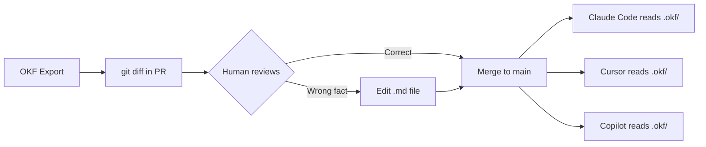

# Cross-LLM Memory Sharing via OKF Export

**Date:** 2026-07-01
**Status:** Prototype complete
**Author:** Hermes Agent
**Repo:** `memorybridge/scripts/export-okf.py`

---

## The Problem

MemoryBridge stores 700+ persistent facts, decisions, insights, and preferences in SQLite. Every Hermes session loads relevant memories automatically via the MemoryBridge plugin. Fast, context-aware, useful.

But it's a closed ecosystem. Claude Code can't call `memorybridge_search`. Cursor can't hit port `:8484`. Copilot has no SQLite access. If you switch agents or start a session without the MemoryBridge HTTP bridge running, that knowledge is invisible.

The goal: **portable agent memory that any LLM tool can read**, not locked inside one runtime.

---

## The Solution: OKF as the Interop Layer

The [Open Knowledge Format](https://developers.googleblog.com/) (OKF, v0.1, Apache 2.0, June 12 2026) is a vendor-neutral spec for representing team/system knowledge as a directory of markdown files with YAML frontmatter. It's git-diffable, human-editable, and requires zero runtime — any agent with file access can read it.

The architecture:

```
┌─────────────────────────────────────────────────┐
│ Hermes Session                                   │
│  ┌─────────────────────────────────────────────┐ │
│  │ MemoryBridge (SQLite)                       │ │
│  │  - fast semantic search (FTS5 + embeddings) │ │
│  │  - auto-capture per turn                    │ │
│  │  - context injection via Hermes plugin      │ │
│  │  - reflection/synthesis                     │ │
│  └──────────────┬──────────────────────────────┘ │
│                 │ export-okf.py (on change)       │
│                 ▼                                 │
│  ┌─────────────────────────────────────────────┐ │
│  │ OKF Export (.okf/ directory)                │ │
│  │  - 1 file = 1 concept                       │ │
│  │  - typed frontmatter (Fact, Decision, etc.) │ │
│  │  - markdown link graph between concepts     │ │
│  └─────────────────────────────────────────────┘ │
└──────────────────────────────────────────────────┘
         │ checked into git (alongside code)
         ▼
┌──────────────────────────────────────────────────┐
│ Any agent (Claude Code, Cursor, Copilot, Codex)   │
│  reads .okf/ from the repo filesystem              │
│  npx skills add scaccogatto/okf-skills             │
└──────────────────────────────────────────────────┘
```

**Key insight:** MemoryBridge is the *writer* — fast, automatic, good at capturing implicit knowledge as it surfaces in conversation. OKF is the *publish* layer — portable, reviewable, cross-agent. They're not competing. MemoryBridge populates OKF; OKF makes it universal.

---

## What OKF Is (the short version)

OKF is a **format spec, not a platform.** No SDK, no schema registry, no runtime. Just a directory convention:

```
.okf/
├── index.md              ← progressive entry point (one per directory level)
├── log.md                ← dated change history
├── services/auth-api.md  ← one concept = one file
├── datasets/orders-db.md
├── decisions/why-postgres.md
└── ...
```

**Every file has exactly one required frontmatter field:** `type`. Everything else — `title`, `description`, `tags`, `timestamp`, `importance` — is optional. Markdown links between files form a graph that any agent can traverse by following standard links.

Google shipped three things alongside the spec:
1. A **BigQuery enrichment agent** that auto-generates OKF bundles from data warehouse schemas
2. A **static HTML visualizer** (single-file interactive graph view)
3. **Sample bundles** on GitHub for GA4 e-commerce, Stack Overflow, and Bitcoin datasets

---

## The Prototype: `scripts/export-okf.py`

A standalone Python script (zero external dependencies beyond Python stdlib + `sqlite3`) that:

1. Reads MemoryBridge SQLite at `~/memorybridge/memory.db`
2. Groups by project → category
3. Writes one OKF concept file per memory with proper frontmatter
4. Generates `index.md` at every directory level for progressive disclosure
5. Writes `log.md` with export metadata and statistics
6. Links related concepts by tag overlap

**MemoryBridge → OKF type mapping:**

| MemoryBridge Category | OKF `type` |
|---|---|
| `fact` | `Fact` |
| `decision` | `Decision` |
| `insight` | `Insight` |
| `preference` | `Preference` |
| `constraint` | `Constraint` |
| `skill` | `Skill` |
| `relationship` | `Relationship` |
| `project_status` | `Status` |

**Usage:**

```bash
# Full export
python3 scripts/export-okf.py --out ./memorybridge.okf

# Single project only
python3 scripts/export-okf.py --out ./memorybridge.okf --project "Hermes Agent"

# Preview without writing
python3 scripts/export-okf.py --preview

# Minimum importance filter
python3 scripts/export-okf.py --out ./curated.okf --min-importance high
```

**Example concept file:**

```markdown
---
type: Decision
title: "The user decided not to productize MemoryBridge"
description: "After considering the effort and license implications."
tags: [decision, platform, architecture]
importance: high
timestamp: 2026-06-21T16:08:50.536860
project: Hermes Agent
---
# The user decided not to productize MemoryBridge

The user decided not to productize MemoryBridge after considering the
effort and license implications.

See also [decisions/architecture-first.md](./architecture-first.md)
for the broader design philosophy.

---
*MemoryBridge ID: `mem_f5aa1577`*
```

---

## Demo Results

Export of the full MemoryBridge (698 active memories):

| Metric | Value |
|---|---|
| Concept files | 698 |
| Index files | 39 |
| Total size | 3.0 MB |
| Projects represented | 13 |
| Categories used | 8 |

**Tree excerpt:**

```
memorybridge.okf/
├── index.md
├── log.md
├── Hermes Agent/
│   ├── index.md
│   ├── decision/  (22 concepts)
│   ├── fact/      (119 concepts)
│   ├── constraint/(15 concepts)
│   └── project_status/ (30 concepts)
├── ops_radar/
│   └── insight/   (333 concepts)
├── roithatworks.com/
│   ├── fact/
│   └── decision/
├── controlaltrecover/
│   └── ...
└── _unassigned/
    └── ...  (106 orphaned memories)
```

---

## The Layered Memory Model

OKF slots into an existing stack. Each layer answers a different question:

```
┌──────────────────────────────────────────────────┐
│ CLAUDE.md / AGENTS.md                           │
│  Answer: How should the agent behave?            │
│  Scope: Per-project behavioral instructions      │
├──────────────────────────────────────────────────┤
│ OKF Bundle (.okf/)                              │
│  Answer: What does the team know?                │
│  Scope: Curated, cross-project, any agent        │
├──────────────────────────────────────────────────┤
│ MemoryBridge (SQLite)                           │
│  Answer: What was said/captured?                 │
│  Scope: Auto-captured, fast retrieval, reflection │
├──────────────────────────────────────────────────┤
│ MCP Connections                                 │
│  Answer: What live tools are available?          │
│  Scope: Runtime access to APIs, databases, etc.  │
└──────────────────────────────────────────────────┘
```

They compose. A `CLAUDE.md` file might say: "Before any analytics task, read `.okf/metrics/`." The OKF bundle is the structured knowledge `CLAUDE.md` points at. MCP connections are the live data sources OKF documents describe.

**OKF doesn't replace MemoryBridge.** It fills the gap that MemoryBridge can't — portable, git-diffable, reviewable knowledge that travels with the code.

---

## Workflow

### Export (automated)


Either run on a cron schedule (daily/weekly) or trigger post-session via a cron job.

### Correction loop (human-in-the-loop)

1. OKF export runs → generates `.okf/` → checked into repo → PR created
2. You `git diff` the PR — spot a wrong fact or outdated decision in the `.md` files
3. Edit the `.md` file directly in the PR (no tooling needed — it's markdown)
4. PR merges → corrected knowledge flows to every agent that reads `.okf/`



### Import direction (future)

OKF edits made directly by humans or other agents can be re-imported into MemoryBridge, making the loop bidirectional. This would allow:

- A teammate edits `.okf/decisions/why-postgres.md` in VS Code
- Next export cycle picks up the changes
- MemoryBridge learns the correction
- Subsequent Hermes sessions reflect the updated fact

---

## What This Unlocks

| Capability | Before (MemoryBridge only) | After (+ OKF export) |
|---|---|---|
| Cross-agent memory | ❌ Hermes-only | ✅ Any agent with file access |
| PR reviewable knowledge | ❌ SQLite binary | ✅ `.md` files in git diff |
| Human-editable without tooling | ❌ Needs HTTP bridge | ✅ VS Code, any text editor |
| Git-diffable history | ❌ | ✅ Every concept versioned |
| Graph traversal | ❌ Tags only | ✅ Markdown links between concepts |
| Google Cloud interop | ❌ | ✅ BigQuery Knowledge Catalog |
| Team adoption | ❌ Everyone needs MemoryBridge | ✅ Just needs file access |

---

## What's Not Solved Yet (and That's OK)

| Gap | Impact | Path to fix |
|---|---|---|
| **One-directional** (MemoryBridge→OKF only) | Manual OKF edits don't flow back | Add `import-okf.py` script |
| **Project name drift** | `ops_radar` vs `ops-radar` vs `hermes` vs `Hermes Agent` | Normalize in DB or export |
| **No stale detection** | Old facts persist until manually corrected | Add `last_accessed` check + prune |
| **Importance-only filter** | Coarse-grained | Add tag-based include/exclude |
| **No dedup across OKF ↔ MemoryBridge** | Same fact could exist in both | Content hash matching on import |
| **No server-side OKF sync** | Relies on cron or manual run | Webhook trigger on memory write |
| **Rich relationship types** | Links are plain markdown (no `supersedes`/`contradicts`) | OKF v0.2 community feature |

---

## Recommendation

**Ship the export as a standard part of MemoryBridge.** It's 200 lines of Python, zero deps, and the output is immediately useful:

1. Check the `scripts/export-okf.py` into the memorybridge repo
2. Set up a weekly cron to auto-export and commit to a designated repo
3. Start correcting facts in PRs and see if the cycle holds
4. Add the import direction once the correction loop proves valuable

The OKF format is boring on purpose — that's what makes it infrastructure. MemoryBridge already solves the hard part (fast retrieval, semantic search, auto-capture). OKF is the export nozzle that makes it universal.
